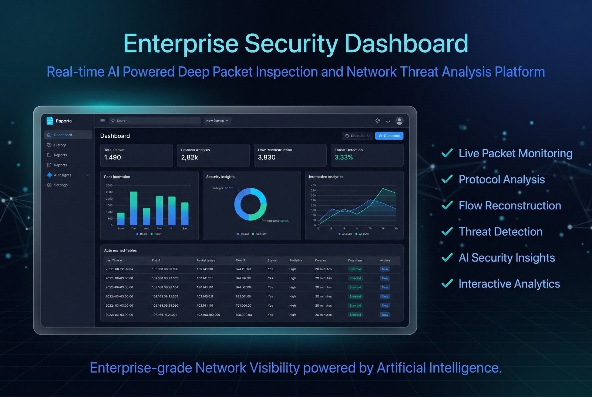
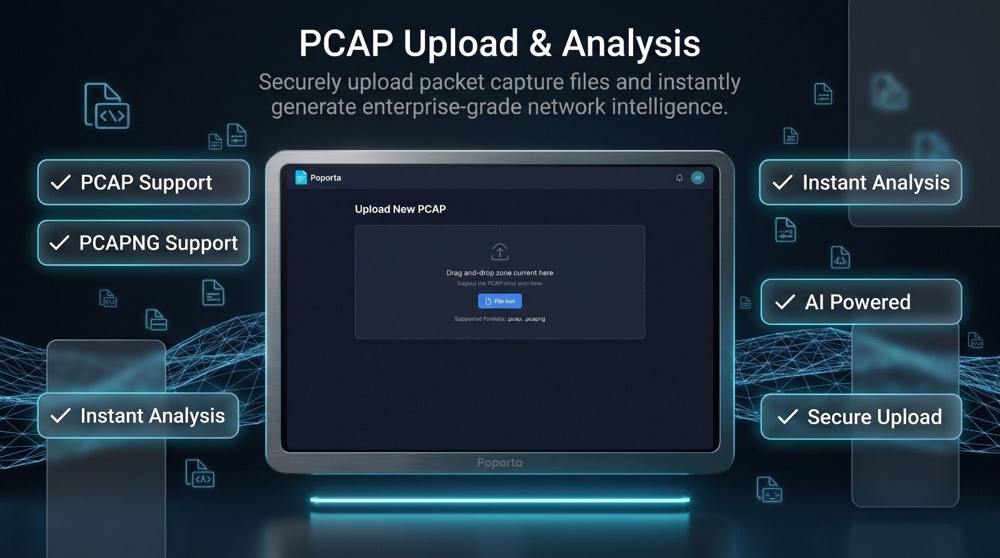
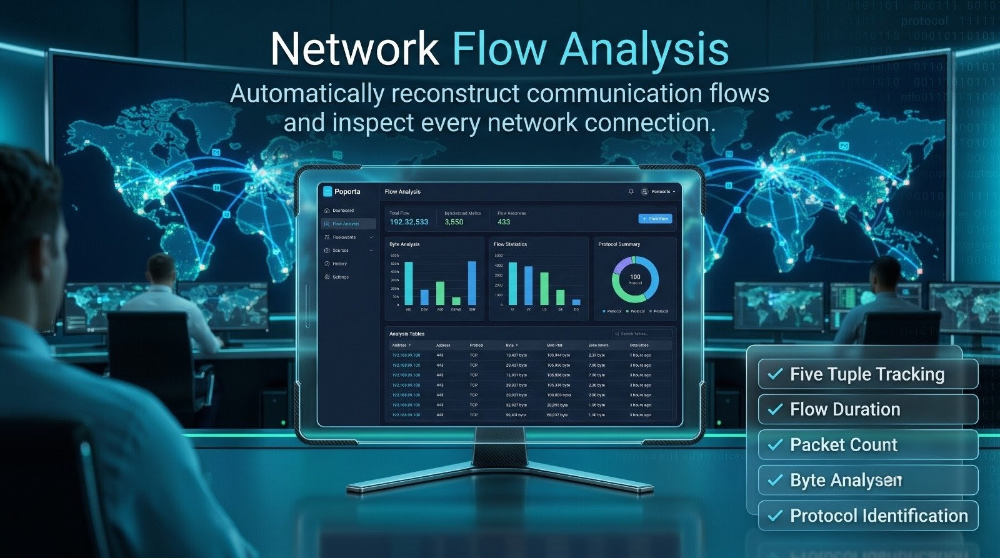
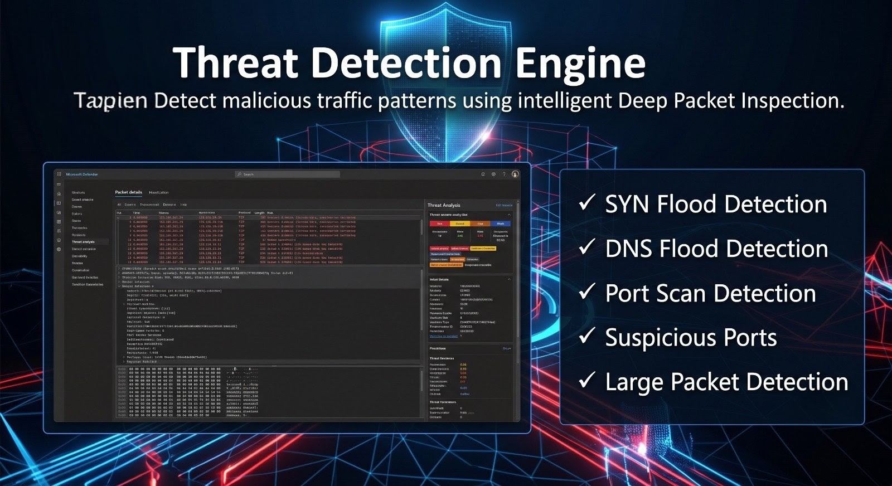
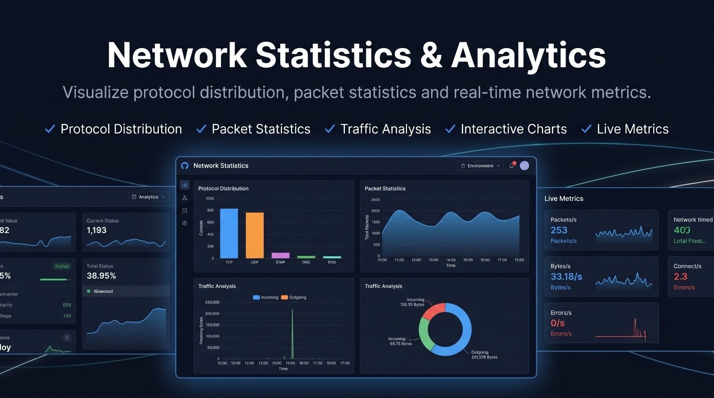
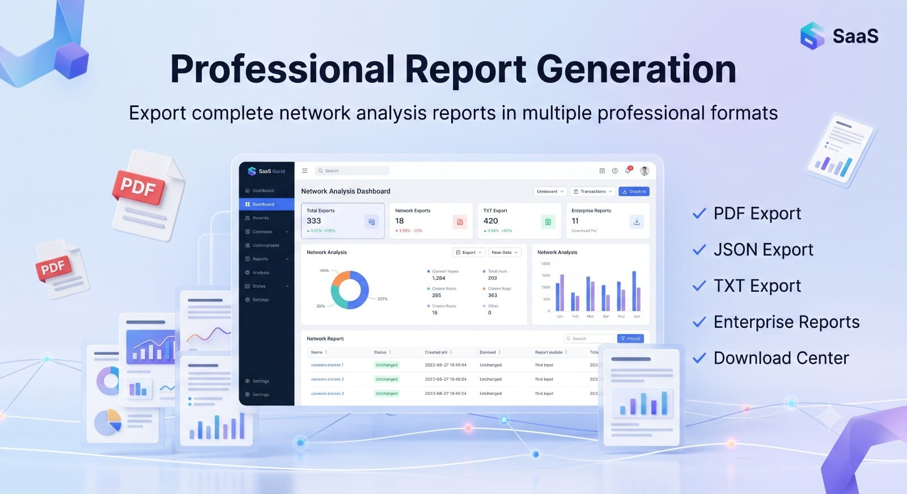
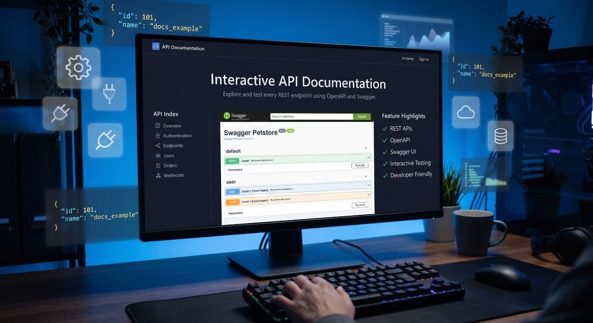

<div align="center">

# 🛡️ AI Powered Deep Packet Inspection & Network Threat Analyzer

### Enterprise-grade Network Traffic Analysis Platform built using React, Spring Boot & PostgreSQL

<p align="center">


</p>

---

### 🔍 Inspect Packets • 📊 Analyze Traffic • 🤖 Detect Threats • 📄 Generate Reports

An enterprise-inspired **Deep Packet Inspection (DPI)** platform capable of parsing PCAP files, analyzing network traffic, detecting suspicious activities, generating AI-powered security insights, and exporting professional reports.

</div>

---

# 📖 Overview

AI Powered Deep Packet Inspection & Network Threat Analyzer is a full-stack cybersecurity platform that performs comprehensive analysis of packet capture (PCAP) files.

Instead of only displaying raw packet information, the platform reconstructs network flows, extracts protocol statistics, detects suspicious behavior, generates intelligent insights, and exports detailed reports in multiple formats.

The project was designed to simulate the workflow of modern enterprise network monitoring solutions and demonstrates the integration of frontend engineering, backend development, database management, authentication, and security analytics into a single application.

---

# ✨ Key Highlights

- 🔐 JWT Authentication & Authorization
- 📂 Secure PCAP Upload
- 📊 Deep Packet Inspection Engine
- 🌐 Network Flow Reconstruction
- 📈 Live Dashboard Analytics
- 🚨 Threat Detection Engine
- 🤖 AI Generated Security Insights
- 📄 PDF Report Generation
- 📄 JSON Export
- 📄 Text Report Export
- 🗃️ Analysis History
- ⚙️ Enterprise Settings Module
- 📉 Interactive Charts
- 🎨 Modern Glassmorphism UI
- ⚡ Framer Motion Animations
- 🌙 Premium Dark Theme
- 📱 Responsive Dashboard
- 🐳 Docker Ready Architecture

---

# 🎯 Objectives

This project was developed to demonstrate the practical implementation of modern cybersecurity concepts including:

- Deep Packet Inspection (DPI)
- Network Traffic Analysis
- Flow Reconstruction
- Threat Detection
- Secure Authentication
- Report Generation
- Enterprise Dashboard Design
- REST API Development
- Database Integration
- Full Stack Development

---

# 🚀 Features

## 🔐 Authentication

- User Registration
- Secure Login
- JWT Authentication
- Protected Routes
- Password Encryption
- Session Management
- Logout Support

---

## 📂 Packet Processing

- Upload PCAP Files
- Upload PCAPNG Files
- Packet Parsing
- Header Extraction
- Protocol Detection
- IP Extraction
- TCP/UDP Analysis
- HTTP/HTTPS Detection
- DNS Analysis

---

## 🌐 Flow Analysis

- Five Tuple Identification
- Source IP Detection
- Destination IP Detection
- Protocol Identification
- Packet Counting
- Byte Counting
- Flow Duration
- Flow Statistics

---

## 🚨 Threat Detection

- SYN Flood Detection
- Port Scan Detection
- DNS Flood Detection
- Large Packet Detection
- Suspicious Port Identification
- Threat Counter
- Threat Summary

---

## 🤖 AI Insights

- Risk Score
- Risk Level
- AI Summary
- Security Recommendations
- Threat Assessment

---

## 📊 Dashboard

- Live Statistics
- Interactive Cards
- Flow Table
- Threat Panel
- Protocol Distribution
- Packet Statistics
- Threat Charts

---

## 📄 Reports

- JSON Report
- Text Report
- PDF Report
- Report Summary
- Download Manager

---

## 📚 History

- Previous Analyses
- Search
- Filtering
- Report Tracking

---

## ⚙️ Settings

- User Profile
- Application Information
- System Status
- Security Information
- About Project
- Danger Zone

---

# 🏗️ System Architecture

The application follows a layered enterprise architecture.

```

                React + Tailwind CSS
                        │
                        ▼
                Spring Boot REST API
                        │
      ┌─────────────────┼──────────────────┐
      ▼                 ▼                  ▼
 Packet Parser     Flow Analyzer     Threat Detector
      │                 │                  │
      └─────────────────┼──────────────────┘
                        ▼
                Statistics Engine
                        │
                        ▼
                 AI Insight Engine
                        │
                        ▼
                   PostgreSQL
                        │
                        ▼
        Reports (PDF • JSON • TXT)

```

A detailed architecture explanation is available inside:

```
docs/architecture/
```

---

# 💻 Technology Stack

| Layer | Technology |
|--------|------------|
| Frontend | React |
| Styling | Tailwind CSS |
| Animation | Framer Motion |
| Charts | Chart.js |
| Icons | Lucide React |
| Backend | Spring Boot |
| Security | Spring Security + JWT |
| Database | PostgreSQL |
| Build Tool | Maven |
| Containerization | Docker |
| Version Control | Git & GitHub |

---

# 📂 Project Structure

```text
AI-Powered-Deep-Packet-Inspection-and-Network-Threat-Analyzer/

├── backend/
│   ├── src/
│   ├── uploads/
│   ├── reports/
│   └── pom.xml
│
├── frontend/
│   ├── src/
│   ├── public/
│   └── package.json
│
├── docs/
│   ├── api/
│   ├── architecture/
│   ├── screenshots/
│   ├── installation.md
│   ├── roadmap.md
│   └── project-report.pdf
│
├── sample-pcaps/
│
├── docker-compose.yml
├── CHANGELOG.md
└── README.md
```

---

# 📚 Documentation

Complete documentation is available in the `docs` directory.

| Documentation | Location |
|---------------|----------|
| Installation Guide | `docs/installation.md` |
| API Documentation | `docs/api/api-documentation.md` |
| API Endpoints | `docs/api/endpoints.md` |
| Architecture | `docs/architecture/` |
| Screenshots | `docs/screenshots/` |
| Roadmap | `docs/roadmap.md` |
| Project Report | `docs/project-report.pdf` |

---

# 📸 Application Screenshots

The application includes a modern enterprise dashboard inspired by professional cybersecurity platforms.

> **Note:** All screenshots are available inside the `docs/screenshots` directory.

---

## 🔐 Login Page

Secure authentication powered by Spring Security and JWT.

<p align="center">

</p>

---

## 📊 Enterprise Dashboard

Real-time analytics dashboard displaying packet statistics, protocol distribution, traffic analysis, and detected threats.

<p align="center">

</p>

---

## 📂 PCAP Upload

Upload `.pcap` and `.pcapng` files for automated Deep Packet Inspection.

<p align="center">

</p>

---

## 🌐 Network Flow Analysis

View reconstructed network flows including packet count, bytes transferred, protocols, and communication duration.

<p align="center">

</p>

---

## 🚨 Threat Detection

Automatically detects suspicious traffic including:

- SYN Flood
- Port Scan
- DNS Flood
- Large Packets
- Suspicious Ports

<p align="center">

</p>

---

## 📈 Statistics Dashboard

Visual representation of network traffic.

- Packet Statistics
- Protocol Distribution
- Threat Overview

<p align="center">

</p>

---

## 📄 Report Generation

Export detailed analysis in multiple formats.

- PDF
- JSON
- TXT

<p align="center">

</p>

---

## 📚 Swagger API

Interactive API documentation generated using Swagger.

<p align="center">

</p>

---

# ⚙️ Installation

## Clone Repository

```bash
git clone https://github.com/Srvankit/AI-Powered-Deep-Packet-Inspection-and-Network-Threat-Analyzer.git

cd AI-Powered-Deep-Packet-Inspection-and-Network-Threat-Analyzer
```

---

# 📦 Backend Setup

Move into backend

```bash
cd backend
```

Install dependencies

```bash
mvn clean install
```

Run application

```bash
mvn spring-boot:run
```

Backend runs at

```
http://localhost:8080
```

---

# 💻 Frontend Setup

Move into frontend

```bash
cd frontend
```

Install packages

```bash
npm install
```

Run development server

```bash
npm run dev
```

Frontend runs at

```
http://localhost:5173
```

---

# 🐘 PostgreSQL Configuration

Create a PostgreSQL database.

Example:

```
dpi_database
```

Update

```
backend/src/main/resources/application.properties
```

Configure

```
spring.datasource.url=

spring.datasource.username=

spring.datasource.password=
```

---

# 🐳 Docker

Run entire application

```bash
docker compose up --build
```

Stop

```bash
docker compose down
```

---

# ▶ Running the Application

### Step 1

Start PostgreSQL

↓

### Step 2

Run Spring Boot Backend

↓

### Step 3

Run React Frontend

↓

### Step 4

Open

```
http://localhost:5173
```

↓

### Step 5

Register/Login

↓

### Step 6

Upload PCAP File

↓

### Step 7

Analyze Traffic

↓

### Step 8

View Dashboard

↓

### Step 9

Generate Reports

---

# 🔄 Application Workflow

```
PCAP Upload
      │
      ▼
Packet Parsing
      │
      ▼
Protocol Identification
      │
      ▼
Flow Reconstruction
      │
      ▼
Threat Detection
      │
      ▼
Statistics Generation
      │
      ▼
AI Security Insights
      │
      ▼
Dashboard Visualization
      │
      ▼
Report Generation
```

---

# 📡 REST API

## Authentication

```
POST /api/auth/register

POST /api/auth/login
```

---

## Analysis

```
POST /api/analyze
```

---

## Reports

```
GET /api/report/json

GET /api/report/pdf

GET /api/report/text
```

---

## AI

```
GET /api/insights
```

---

## History

```
GET /api/history
```

---

Complete API documentation can be found inside

```
docs/api/
```

---

# 🧪 Sample PCAP Files

Sample packet capture files are available inside

```
sample-pcaps/
```

These files can be directly uploaded to test the application without creating your own packet captures.

---

# 📊 Performance Highlights

✔ Fast packet parsing

✔ Efficient flow reconstruction

✔ Optimized statistics engine

✔ Lightweight React frontend

✔ Secure JWT authentication

✔ Interactive dashboard

✔ Multi-format report generation

✔ Enterprise-inspired UI

---

# 🔒 Security Features

Security has been one of the primary focuses while developing this platform.

The application implements multiple security mechanisms to ensure safe communication and secure access to protected resources.

## Authentication

- JSON Web Token (JWT) Authentication
- Secure Login & Registration
- Password Encryption
- Protected API Endpoints
- Stateless Authentication
- Session Management

---

## Backend Security

- Spring Security Integration
- Request Authorization
- CORS Configuration
- Exception Handling
- Secure REST APIs
- Input Validation

---

## Network Analysis Security

- Deep Packet Inspection
- Protocol Identification
- Flow Reconstruction
- Suspicious Traffic Detection
- Threat Classification
- Network Statistics Generation

---

# 📈 Project Roadmap

## ✅ Completed

- User Authentication
- Dashboard
- Packet Upload
- Deep Packet Inspection Engine
- Packet Statistics
- Flow Analysis
- Threat Detection
- AI Insights
- PDF Report Generation
- JSON Export
- TXT Export
- Analysis History
- Modern Enterprise UI
- Settings Module
- Responsive Dashboard
- Docker Support
- Documentation

---

## 🚧 Planned Improvements

- Live Packet Capture
- Real-Time Network Monitoring
- AI Anomaly Detection
- Machine Learning Threat Classification
- Elasticsearch Integration
- Kafka Streaming
- SIEM Integration
- Email Notifications
- Role Based Access Control (RBAC)
- Multi User Support
- Admin Dashboard
- Kubernetes Deployment
- Cloud Deployment
- Prometheus Metrics
- Grafana Monitoring

---

# 🌟 Future Scope

The platform has been designed with scalability in mind.

Potential future enhancements include:

- Live Packet Sniffing
- AI Based Threat Prediction
- Malware Signature Detection
- Intrusion Detection System (IDS)
- Intrusion Prevention System (IPS)
- Real-Time Alert Engine
- Distributed Packet Processing
- High Availability Deployment
- Cloud Native Architecture
- Kubernetes Support
- Multi Tenant Architecture
- SIEM Integration
- Security Information Dashboard
- Threat Intelligence Integration

---

# 📚 Documentation

Additional documentation is available inside the **docs** directory.

| File | Description |
|------|-------------|
| installation.md | Installation Guide |
| roadmap.md | Development Roadmap |
| api/api-documentation.md | API Documentation |
| api/endpoints.md | REST Endpoints |
| architecture/ | Architecture Diagrams |
| screenshots/ | Application Screenshots |
| project-report.pdf | Complete Project Report |

---

# 🤝 Contributing

Contributions are always welcome.

If you would like to contribute:

1. Fork this repository

2. Create your feature branch

```bash
git checkout -b feature/new-feature
```

3. Commit your changes

```bash
git commit -m "feat: add new feature"
```

4. Push to your branch

```bash
git push origin feature/new-feature
```

5. Open a Pull Request

---

# 📝 License

This project is licensed under the **MIT License**.

You are free to use, modify and distribute this project under the terms of the license.

---

# 👨‍💻 Author

## Ankit Yadav

Full Stack Developer • Java Developer • Cybersecurity Enthusiast

### Skills

- Java
- Spring Boot
- React
- PostgreSQL
- Tailwind CSS
- REST APIs
- JWT Authentication
- Docker
- Network Security

---

### GitHub

https://github.com/Srvankit

---

### Repository

https://github.com/Srvankit/AI-Powered-Deep-Packet-Inspection-and-Network-Threat-Analyzer

---

# 🙏 Acknowledgements

Special thanks to the open-source community and the creators of the technologies that made this project possible.

- React
- Spring Boot
- PostgreSQL
- Tailwind CSS
- Framer Motion
- Chart.js
- Lucide React
- Maven
- Docker

---

# ⭐ Support

If you found this project useful:

⭐ Star this repository

🍴 Fork the repository

📢 Share it with others

Your support motivates future improvements.

---

# 📊 Project Statistics

| Category | Status |
|-----------|--------|
| Backend | ✅ Completed |
| Frontend | ✅ Completed |
| Authentication | ✅ Completed |
| Packet Processing | ✅ Completed |
| Threat Detection | ✅ Completed |
| AI Insights | ✅ Completed |
| Reports | ✅ Completed |
| History | ✅ Completed |
| Dashboard | ✅ Completed |
| Settings | ✅ Completed |
| Documentation | ✅ Completed |

---

<div align="center">

## 🛡️ AI Powered Deep Packet Inspection & Network Threat Analyzer

### Built with ❤️ using React, Spring Boot & PostgreSQL

⭐ If you like this project, don't forget to star the repository!

**Thank you for visiting this repository.**

</div>